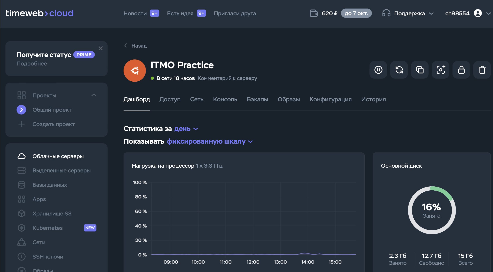
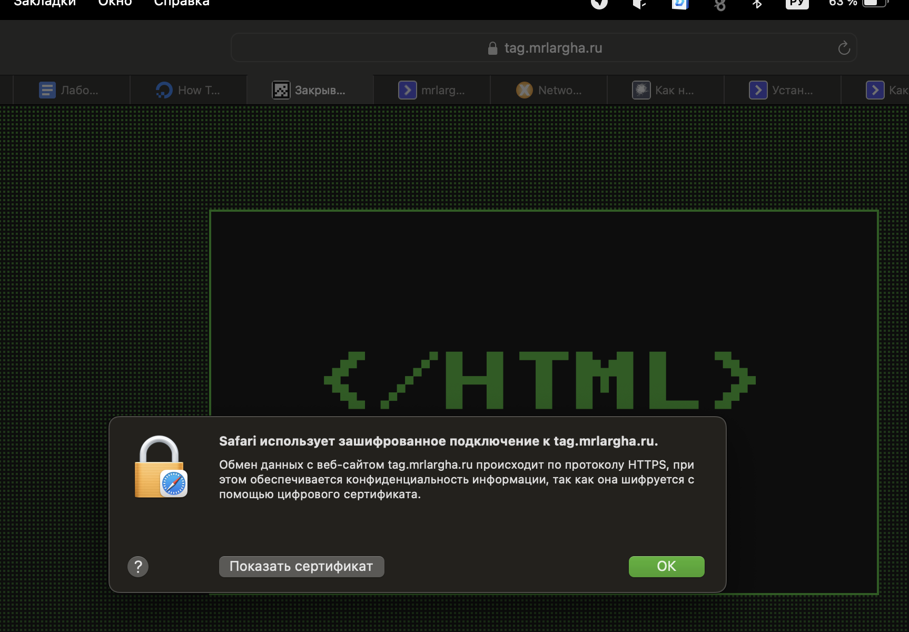

1. Берем и арендуем VDS на timeweb.com (не реклама, но ребята они классные) 
2. Настраиваем SSH-ключи для подключения с компьютера и подключаемся 
   
3. Создаем нового пользователя и выдаем его пароль[screenshot](Pasted image 20240911155935.png)
4. Перелогиниваемся в SSH под новым пользователем и резко вспоминаем, что не прописали ему sudo) [screenshot](Pasted image 20240911160615.png)
5. Перелогиниваемся и радуемся что sudo у нас работает
6. Сразу запускаем обновление индекса APT (во имя коровьей суперсилы, конечно же)[screenshot](Pasted image 20240911160829.png)
7. Радуемся тому, что на NVMe диске пакеты ставятся за секунды, проверяем что не ушатали систему и идем смотреть дальше
8. Невероятно, но все заработало с первого раза[screenshot](Pasted image 20240911161002.png)
9. Смотрим на надпись "небезопасно", смотрим в лабу и понимаем что само неприятное еще впереди
10. Для начала настроим https через letsencrypt и certbot (мы что лохи, чтобы ручками все прописывать) [screenshot](Pasted image 20240911162721.png)
11. certbot установлен, но для начала настроим пару виртуальных хостов и купим домен
12. купил домен mrlargha.ru, жду делегирования домена на ns-сервера яндекса и timeweb[screenshot](Pasted image 20240911164235.png)
13. Скачаем пет-проекты в `/var/www` где и будут валяться наши хосты[screenshot](Pasted image 20240911221301.png)
14. Теперь у нас есть две директории `tag` и `okno` в каждой из которых лежит по сайту на html + css
15. Озаботимся виртуальными хостами, кстати, ns-сервера теперь успешно резолвят домен mrlargha.ru поэтому можно спокойно выпустить себе сертификат letsencrypt
16. Начинаем писать наши любимы и ненаглядные конфиги [screenshot](Pasted image 20240911222329.png) вот первый, для okno[screenshot](Pasted image 20240911222518.png) а вот и второй для tag
17. теперь создаем симлинки в `sites-enabled`[screenshot](Pasted image 20240911222706.png)
18. Идем пинать сервер, чтобы он обновил конфигурации[screenshot](Pasted image 20240911222820.png)
19. Пытаемся зайти по адресу `okno.mrlargha.ru` и вспоминаем что dns понятия не имеет что это за поддомен и как с ним жить, что ж идем и добавляем[screenshot](Pasted image 20240912025026.png)
20. Опять ждем обновления серверов 
21. Проверям[screenshot](Pasted image 20240911223747.png) удивительно, но все работает.
22. Теперь у нас есть 2 виртуальных хоста на разных поддоменах. Самое время получить себе сертификаты. получам по шапке, оказывается dns обновляется не во всем мире сразу (а я то думал...) [screenshot](Pasted image 20240911224144.png)
23. Ждем пока айпишники нашего чуда совершают кругосветку
24. Урааа, наши сертфикатики выданы[screenshot](Pasted image 20240911232347.png)
25. Все работает
26. Обращаемся к тексту работы, нам нужно настроить редирект с 80го порта, заходим в конфигрурацию и видим там[screenshot](Pasted image 20240912010132.png)
27. Как мы видим, certbot уже дополнил конфигурацию, теперь при обращению к хосту по 80 порту, мы получим HTTP 301 **Moved Permanently** и адрес сервера с протоколом http. В таком случае браузер автоматически перенаправит пользователя по нужному нам адресу, используя зашифрованное соединение. Интересно, что certbot оставляет поведение на случай, если хост был указан неверно - мы получим 404. Скорее всего это сделано в целях безопасности
28. По поводу `alias` в моем случае весь сайт лежит в одной папке. [screenshot](Pasted image 20240912011241.png)alias тут можно использовать, прописав `location / {alias /var/www/okno;}` но я не вижу в этом особой необходимости
29. На всякий случай поясню, что я понимаю разницу между root и alias. Если прописать root  в location, то по запросу будет сформирован адрес root + location. Если прописать alias, а не root, то по запросу будет выдан адрес РАВНЫЙ alias. (объяснил косноязычно) Могу в принципе расписать, но тут объяснили лучше https://stackoverflow.com/questions/10631933/nginx-static-file-serving-confusion-with-root-alias
